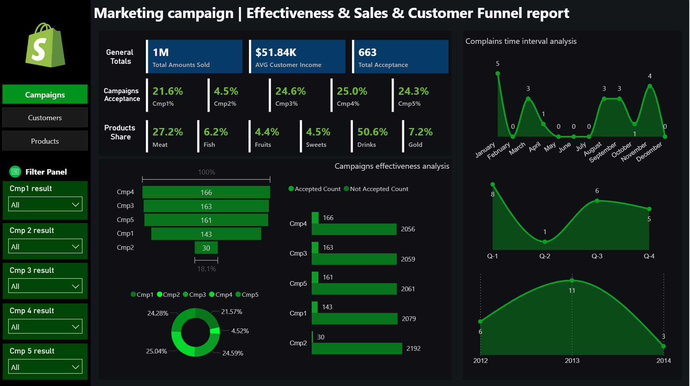
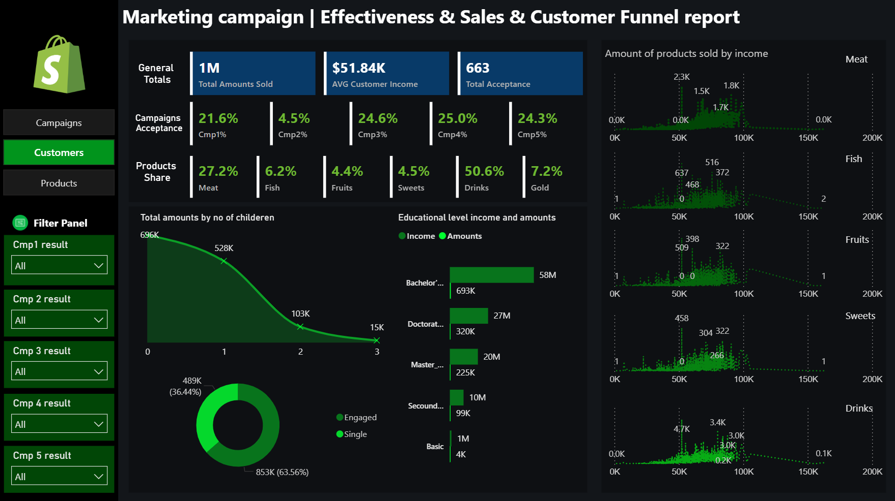
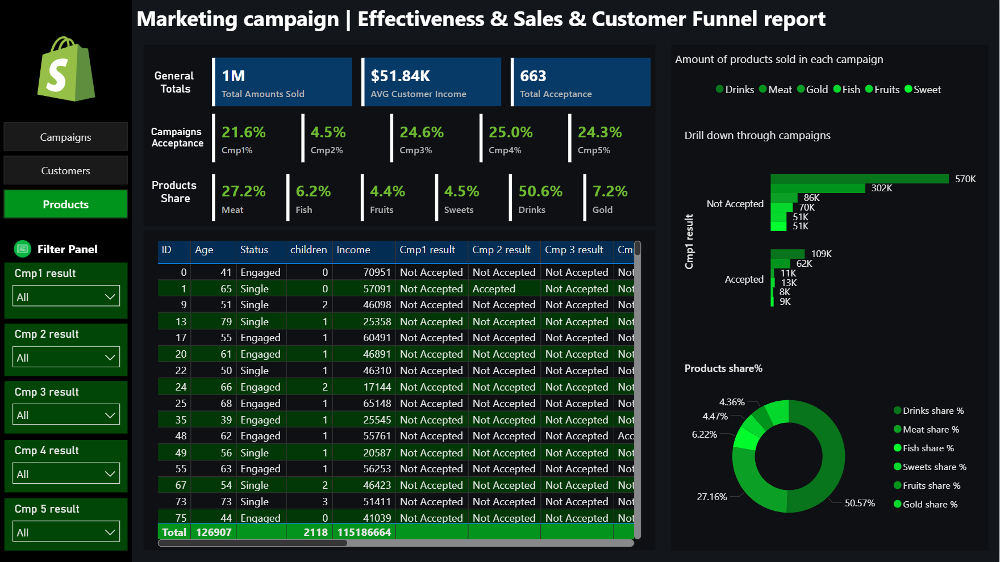
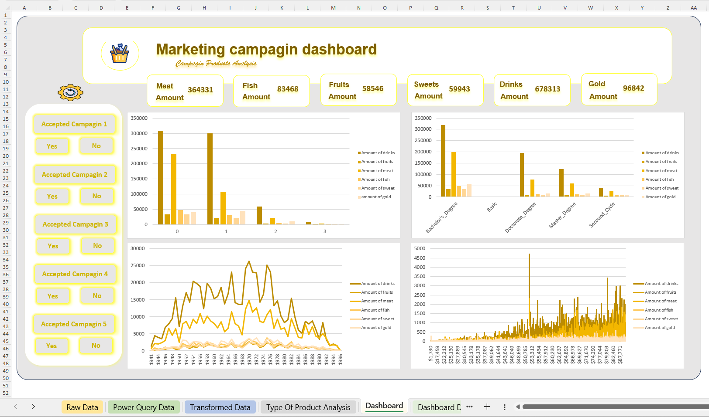
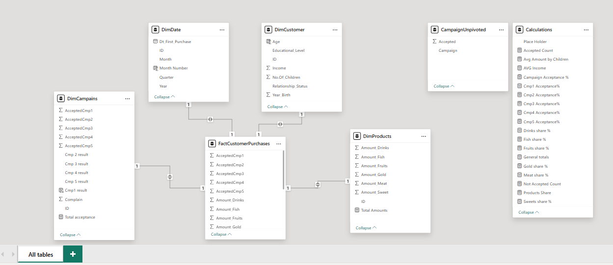

# Marketing Campaign Analytics


A comprehensive data analytics project analyzing marketing campaign effectiveness, customer behavior, and product profitability across 5 campaigns using Power BI dashboards, Excel analytics, and SQL Server.

##  Project Overview

This project leverages campaign data to provide actionable insights for marketing optimization:

- **1M+** total sales across 5 campaigns
- **663** customer conversions (13.3% overall acceptance rate)
- **50.6%** market share dominated by Drinks category
- **$51.84K** average customer income
- **0.5%** complaint ratio (low operational risk)

  ##  Quick Start

- **New to this project?** See [Getting Started](#-getting-started)
- **Want to run queries?** Check [SQL Queries](#-sql-queries)
- **Looking for dashboards?** View [Dashboards](#-dashboards)

##  Key Insights

### Campaign Performance
| Campaign | Acceptance Rate | Status |
|----------|-----------------|--------|
| Cmp4 | 25.0% | ⭐ **Top Performer** |
| Cmp5 | 24.3% | ⭐ Strong |
| Cmp3 | 24.6% | ⭐ Strong |
| Cmp1 | 21.6% | Good |
| Cmp2 | 4.5% | ⚠️ Underperforming |

### Product Distribution
- **Drinks** (50.6%) - Traffic driver, 15% margin
- **Meat** (27.2%) - Profit driver, 20% margin  
- **Gold** (7.2%) - Premium segment, 40% margin
- **Fish/Fruits/Sweets** (11%) - Niche categories

### Customer Segments
**Premium Professionals** (Highest Value)
- Education: Bachelor's or higher
- Income: $50K–$100K+
- Status: Engaged, no children
- Age: 45–65 years
- Contribution: ~47% of premium sales

##  Project Structure

```
Marketing-Campaign-Analytics/
├── Dashboards/
│   ├── campaigns.png
│   ├── customers.png
│   ├── products.png
│   ├── excel.png
│   └── model.png
├── SQL/
│   ├── queries.sql
│   └── stored_procedures.sql
├── README.md
└── .gitignore
```

##  Tech Stack

| Component   | Technology                        |
|-------------|-----------------------------------|
| **Database**   | SQL Server 2019+               |
| **Dashboards** | Power BI Desktop                |
| **Analysis**   | Excel (Power Query, Power Pivot)|
| **Language**   | T-SQL                           |
| **Modeling**   | Star Schema (Dimensional)       |
| **Scripting**  | Python                          |


##  Dashboards

### 1. Campaigns Dashboard


Monitor campaign performance across all 5 campaigns with acceptance rates, quarterly trends, and complaint analysis.

**Key Metrics:**
- Campaign acceptance rates and trends
- Quarterly performance comparison
- Complaint patterns over time
- Month-over-month growth

---

### 2. Customers Dashboard


Analyze customer demographics, income patterns, and engagement levels.

**Key Metrics:**
- Sales by income bracket
- Family structure impact on spending
- Educational level analysis
- Engagement status distribution

---

### 3. Products Dashboard


Deep dive into product performance with drill-down capabilities.

**Key Metrics:**
- Product category distribution
- Sales by campaign and product
- Customer preference patterns
- Cross-sell opportunities

---

### 4. Excel Dashboard


Interactive analysis with campaign acceptance toggles and demographic breakdowns.

**Features:**
- Campaign acceptance tracking
- Time-series product analysis
- Educational level segmentation
- Real-time filtering

---

### 5. Data Model


**Star Schema Design:**

**Key Tables:**
- `FactCustomerPurchases` - Transactional data (purchases, campaign responses)
- `DimCustomer` - Customer attributes (age, income, education, family status)
- `DimCampaigns` - Campaign master data and results
- `DimProducts` - Product catalog and categories
- `DimDate` - Temporal dimensions (quarter, month, year)

---

##  SQL Queries

### Core Queries Included

#### 1. Campaign Performance Ranking
```sql
SELECT 
    'Campaign 1' AS Campaign_Name,
    COUNT(CASE WHEN AcceptedCmp1 = 1 THEN 1 END) AS Accepted_Count,
    COUNT(*) AS Total_Customers,
    ROUND((COUNT(CASE WHEN AcceptedCmp1 = 1 THEN 1 END) * 100.0) / COUNT(*), 2) AS Acceptance_Rate_Percent
FROM FactCustomerPurchases
UNION ALL
SELECT 
    'Campaign 2' AS Campaign_Name,
    COUNT(CASE WHEN AcceptedCmp2 = 1 THEN 1 END) AS Accepted_Count,
    COUNT(*) AS Total_Customers,
    ROUND((COUNT(CASE WHEN AcceptedCmp2 = 1 THEN 1 END) * 100.0) / COUNT(*), 2) AS Acceptance_Rate_Percent
FROM FactCustomerPurchases
UNION ALL
SELECT 
    'Campaign 3' AS Campaign_Name,
    COUNT(CASE WHEN AcceptedCmp3 = 1 THEN 1 END) AS Accepted_Count,
    COUNT(*) AS Total_Customers,
    ROUND((COUNT(CASE WHEN AcceptedCmp3 = 1 THEN 1 END) * 100.0) / COUNT(*), 2) AS Acceptance_Rate_Percent
FROM FactCustomerPurchases
UNION ALL
SELECT 
    'Campaign 4' AS Campaign_Name,
    COUNT(CASE WHEN AcceptedCmp4 = 1 THEN 1 END) AS Accepted_Count,
    COUNT(*) AS Total_Customers,
    ROUND((COUNT(CASE WHEN AcceptedCmp4 = 1 THEN 1 END) * 100.0) / COUNT(*), 2) AS Acceptance_Rate_Percent
FROM FactCustomerPurchases
UNION ALL
SELECT 
    'Campaign 5' AS Campaign_Name,
    COUNT(CASE WHEN AcceptedCmp5 = 1 THEN 1 END) AS Accepted_Count,
    COUNT(*) AS Total_Customers,
    ROUND((COUNT(CASE WHEN AcceptedCmp5 = 1 THEN 1 END) * 100.0) / COUNT(*), 2) AS Acceptance_Rate_Percent
FROM FactCustomerPurchases
ORDER BY Acceptance_Rate_Percent DESC;
```

#### 2. Product Performance Analysis
```sql
SELECT 
    'Drinks' AS Product_Category,
    SUM(Amount_Drinks) AS Total_Amount,
    COUNT(*) AS Transaction_Count,
    ROUND(AVG(Amount_Drinks), 2) AS Avg_Amount_Per_Transaction,
    ROUND(SUM(Amount_Drinks) * 0.15, 2) AS Estimated_Profit_15_Margin,
    ROUND((SUM(Amount_Drinks) / (SELECT SUM(Amount_Drinks) + SUM(Amount_Meat) + SUM(Amount_Fish) + SUM(Amount_Fruits) + SUM(Amount_Gold) + SUM(Amount_Sweet) FROM FactCustomerPurchases) * 100), 2) AS Percent_Share
FROM FactCustomerPurchases
UNION ALL
SELECT 
    'Meat' AS Product_Category,
    SUM(Amount_Meat) AS Total_Amount,
    COUNT(*) AS Transaction_Count,
    ROUND(AVG(Amount_Meat), 2) AS Avg_Amount_Per_Transaction,
    ROUND(SUM(Amount_Meat) * 0.20, 2) AS Estimated_Profit_20_Margin,
    ROUND((SUM(Amount_Meat) / (SELECT SUM(Amount_Drinks) + SUM(Amount_Meat) + SUM(Amount_Fish) + SUM(Amount_Fruits) + SUM(Amount_Gold) + SUM(Amount_Sweet) FROM FactCustomerPurchases) * 100), 2) AS Percent_Share
FROM FactCustomerPurchases
UNION ALL
SELECT 
    'Gold' AS Product_Category,
    SUM(Amount_Gold) AS Total_Amount,
    COUNT(*) AS Transaction_Count,
    ROUND(AVG(Amount_Gold), 2) AS Avg_Amount_Per_Transaction,
    ROUND(SUM(Amount_Gold) * 0.40, 2) AS Estimated_Profit_40_Margin,
    ROUND((SUM(Amount_Gold) / (SELECT SUM(Amount_Drinks) + SUM(Amount_Meat) + SUM(Amount_Fish) + SUM(Amount_Fruits) + SUM(Amount_Gold) + SUM(Amount_Sweet) FROM FactCustomerPurchases) * 100), 2) AS Percent_Share
FROM FactCustomerPurchases
ORDER BY Percent_Share DESC;
```

#### 3. Customer Segmentation by Demographics
```sql
SELECT 
    CASE 
        WHEN Education = 2 THEN 'Bachelor' 
        WHEN Education = 3 THEN 'Master'
        WHEN Education = 4 THEN 'Doctorate'
        ELSE 'Other'
    END AS Education_Level,
    CASE 
        WHEN Relationship_Status = 1 THEN 'Single'
        WHEN Relationship_Status = 2 THEN 'Married'
        WHEN Relationship_Status = 3 THEN 'Divorced'
        WHEN Relationship_Status = 4 THEN 'Engaged'
        ELSE 'Other'
    END AS Relationship_Status,
    No_Of_Children,
    COUNT(*) AS Customer_Count,
    ROUND(AVG(Income), 2) AS Avg_Income,
    ROUND(SUM(Amount_Drinks + Amount_Meat + Amount_Fish + Amount_Fruits + Amount_Gold + Amount_Sweet) / COUNT(*), 2) AS Avg_Lifetime_Value,
    ROUND((COUNT(CASE WHEN AcceptedCmp1 = 1 OR AcceptedCmp2 = 1 OR AcceptedCmp3 = 1 OR AcceptedCmp4 = 1 OR AcceptedCmp5 = 1 THEN 1 END) * 100.0) / COUNT(*), 2) AS Campaign_Acceptance_Rate
FROM FactCustomerPurchases
GROUP BY Education, Relationship_Status, No_Of_Children
ORDER BY Avg_Lifetime_Value DESC;
```

#### 4. Customer Lifetime Value
```sql
SELECT TOP 20
    ID,
    Age,
    Income,
    CASE 
        WHEN Education = 1 THEN 'Basic'
        WHEN Education = 2 THEN 'Bachelor'
        WHEN Education = 3 THEN 'Master'
        WHEN Education = 4 THEN 'Doctorate'
        ELSE 'Other'
    END AS Education,
    (Amount_Drinks + Amount_Meat + Amount_Fish + Amount_Fruits + Amount_Gold + Amount_Sweet) AS Total_Spent,
    CASE 
        WHEN (AcceptedCmp1 = 1) OR (AcceptedCmp2 = 1) OR (AcceptedCmp3 = 1) OR (AcceptedCmp4 = 1) OR (AcceptedCmp5 = 1) 
        THEN 'Converted'
        ELSE 'Non-Converted'
    END AS Conversion_Status
FROM FactCustomerPurchases
ORDER BY (Amount_Drinks + Amount_Meat + Amount_Fish + Amount_Fruits + Amount_Gold + Amount_Sweet) DESC;
```

##  Key Recommendations

### Immediate Actions (High Priority)
1. **Phase out Cmp2** - Only 4.5% acceptance rate (ROI negative)
2. **Scale Cmp4 & Cmp5** - Proven top performers at 25%+ acceptance
3. **Implement bundling** - Drinks + Meat + Gold combinations for 18% margin improvement
4. **Target Premium Professionals** - Focus on engaged, Bachelor's educated, age 45–65

### Expected Financial Impact
- Campaign optimization: **+12–15% profit increase**
- Product bundling: **+3–5% overall margin**
- Premium targeting: **+12K Gold units annually**
- Complaint reduction: **+2,000 units retained**
- **Total potential: 15–20% profit improvement**

##  Getting Started

### Prerequisites
- SQL Server 2019 or higher
- Power BI Desktop (free or paid)
- Excel 2016 or higher
- Git (optional)

### Installation

1. **Clone the repository**
```bash
git clone https://github.com/mohamedfouad00/Marketing-Campaign-Analytics.git
cd Marketing-Campaign-Analytics
```

2. **Set up SQL Server**
   - Restore the database backup or create tables using schema scripts
   - Load the data using ETL scripts in `SQL/`

3. **Open Power BI Dashboards**
   - Connect to your SQL Server instance
   - Open `.pbix` files in Power BI Desktop
   - Refresh data connection

4. **Open Excel Analysis**
   - Open Excel workbook
   - Enable Power Query connections
   - Refresh data feeds

### Running Queries

```sql
-- Connect to your database
USE [YourDatabaseName];

-- Execute individual queries
EXEC sp_campaign_performance;
EXEC sp_product_analysis;
EXEC sp_customer_segmentation;
```

##  Usage Examples

### Scenario 1: Analyze Top Campaign Performance
```sql
-- Get Cmp4 details (best performer)
SELECT 
    COUNT(*) AS Exposed_Customers,
    COUNT(CASE WHEN AcceptedCmp4 = 1 THEN 1 END) AS Conversions,
    ROUND((COUNT(CASE WHEN AcceptedCmp4 = 1 THEN 1 END) * 100.0) / COUNT(*), 2) AS Conversion_Rate
FROM FactCustomerPurchases;
```

### Scenario 2: Identify High-Value Customer Segments
```sql
-- Premium professionals profile
SELECT 
    Age,
    Income,
    Education,
    Relationship_Status,
    SUM(Amount_Drinks + Amount_Meat + Amount_Gold) AS Total_Spent
FROM FactCustomerPurchases
WHERE Relationship_Status = 4  -- Engaged
  AND Education IN (2, 3, 4)   -- Bachelor, Master, Doctorate
  AND Age BETWEEN 45 AND 65
GROUP BY Age, Income, Education, Relationship_Status
ORDER BY Total_Spent DESC;
```

### Scenario 3: Budget Reallocation Impact
```sql
-- Impact of moving 20% of Cmp2 budget to Cmp4
-- Current Cmp2: 30 acceptances at 4.5%
-- Projected Cmp4 boost: 166 * 1.2 = ~199 acceptances
-- Expected acceptance increase: ~80 customers
-- Estimated profit boost: 12–15%
```

##  Support & Contact

**Project Author:** Mohamed Fouad  
**Email:** m.fouad.business002@gmail.com  
**LinkedIn:** [Mohamed Fouad](https://linkedin.com/in/mohamed-fouad-88608424b)  
**GitHub:** [@mohamedfouad00](https://github.com/mohamedfouad00)

##  License

This project is provided as-is for educational and business analytical purposes.

##  Contributing

Contributions are welcome! Please follow these steps:

1. Fork the repository
2. Create a feature branch (`git checkout -b feature/amazing-feature`)
3. Commit your changes (`git commit -m 'Add amazing feature'`)
4. Push to the branch (`git push origin feature/amazing-feature`)
5. Open a Pull Request

##  Additional Resources

- [Power BI Documentation](https://app.powerbi.com/view?r=eyJrIjoiYjAwNTRkNTUtMmU0Ny00Y2JmLTgzYmYtNWQyYjRkYmNhZjIxIiwidCI6ImMzMGI1NDRmLWJhMTgtNGUyYy04YjllLTdmYWU5ZmU5NWUzYSJ9)
- [Star Schema Design](https://en.wikipedia.org/wiki/Star_schema)

